# 🌌 WELCOME TO THE MATRIX

<div align="center">

<!-- NUCLEAR ANIMATED HEADER -->
<picture>
  <source media="(prefers-color-scheme: dark)" srcset="https://capsule-render.vercel.app/api?type=cylinder&color=0:FF0080,20:8000FF,40:00FF80,60:FF8000,80:0080FF,100:FF0080&height=400&section=header&text=AARYAN%20SAINI&fontSize=80&fontColor=fff&animation=fadeIn&fontAlignY=30&desc=🔥%20DIGITAL%20ALCHEMIST%20🔥%20CODE%20WIZARD%20🔥%20AI%20ARCHITECT%20🔥&descAlign=50&descAlignY=65&descSize=20&stroke=fff&strokeWidth=2">
  
</picture>

<!-- MATRIX RAIN EFFECT -->


<!-- HOLOGRAPHIC BADGES -->
<p align="center">
  
  
  
  
</p>

<!-- GLITCH EFFECT TEXT -->


</div>

---

## 🌊 NEURAL INTERFACE LOADING...

```ascii
    ╔═══════════════════════════════════════════════════════════════╗
    ║  ███████╗██╗   ██╗██████╗ ███████╗██████╗  ██████╗ ██████╗   ║
    ║  ██╔════╝██║   ██║██╔══██╗██╔════╝██╔══██╗██╔════╝██╔═══██╗  ║
    ║  ███████╗██║   ██║██████╔╝█████╗  ██████╔╝██║     ██║   ██║  ║
    ║  ╚════██║██║   ██║██╔═══╝ ██╔══╝  ██╔══██╗██║     ██║   ██║  ║
    ║  ███████║╚██████╔╝██║     ███████╗██║  ██║╚██████╗╚██████╔╝  ║
    ║  ╚══════╝ ╚═════╝ ╚═╝     ╚══════╝╚═╝  ╚═╝ ╚═════╝ ╚═════╝   ║
    ╚═══════════════════════════════════════════════════════════════╝
                    🔥 INITIATING NEURAL LINK 🔥
                          ▓▓▓▓▓▓▓▓▓▓ 100%
```

<div align="center">

<!-- PSYCHEDELIC STATUS -->


</div>

---

## 🧬 CYBERNETIC ENHANCEMENT MATRIX

```mermaid
mindmap
  root((🧠 AARYAN SAINI<br/>DIGITAL OVERLORD))
    🔥 FRONTEND DOMINATION
      ⚛️ React Mastery
        🎨 UI/UX Wizardry  
        📱 Mobile Supremacy
        🚀 Performance Hacking
      🌈 CSS Sorcery
        🎭 Animation Magic
        🎨 Responsive Design
        🌙 Dark Mode Mastery
    🤖 AI/ML SUPREMACY  
      🧮 Neural Networks
        👁️ Computer Vision
        🧠 Deep Learning
        🔮 Pattern Recognition
      🐍 Python Domination
        📊 Data Manipulation
        🔬 Scientific Computing
        📈 Visualization Gods
    🗄️ DATABASE OVERLORD
      🐬 MySQL Mastery
        ⚡ Query Optimization
        🔒 Security Fortress
        📊 Performance Tuning
      🔥 Firebase/NoSQL
        ☁️ Cloud Architecture
        📱 Real-time Sync
        🌐 Global Distribution
    🌟 SOFT SKILLS NEXUS
      🎯 Leadership Alpha
      🤝 Collaboration Pro
      💡 Innovation Engine
      🎭 Problem Solving God
```

<div align="center">



</div>

---

## 💀 TECH ARSENAL - WEAPONS OF MASS CREATION

<div align="center">

### 🔥 PRIMARY WEAPONS


<p align="center">
  
</p>

### 🧪 LEGENDARY ARTIFACTS
<p align="center">
  
  
  
  
  
  
</p>

### 🚀 SPECIALIZED NANO-TECH
<p align="center">
  
  
  
  
  
  
</p>

</div>

---

## 🏆 PROJECT DIMENSION - WHERE DREAMS BECOME REALITY

<div align="center">


</div>

<table align="center" width="100%">
<tr>
<td width="33%" align="center">

### 👁️‍🗨️ DIABETIC RETINOPATHY AI
### 🔮 THE EYE OF SAURON


```python
# GODMODE ACTIVATED
class RetinaAI:
    def __init__(self):
        self.power_level = 9001
        self.accuracy = 85.7
        self.samples_conquered = 50000
        self.lives_saved = "INFINITE"
        self.status = "LEGENDARY"
```

**🎯 IMPACT:** Preventing blindness across dimensions  
**🧬 TECH DNA:** `TensorFlow` `Keras` `OpenCV` `NumPy`  
**⚡ POWER:** 85.7% accuracy, 0.23 loss coefficient  
**🌟 CLASSIFICATION:** Mild | Moderate | Severe | NUCLEAR


</td>
<td width="33%" align="center">

### 🆘 EMERGENCY SOS NEXUS
### ⚡ GUARDIAN ANGEL PROTOCOL


```javascript
// HERO MODE ENGAGED
const GuardianAngel = {
  responseTime: "< 30 SECONDS",
  coverage: "GLOBAL DOMINATION",
  reliability: "99.99% UPTIME",
  emergencyProtocol: "ACTIVATE",
  heroStatus: "LEGENDARY"
}
```

**🎯 IMPACT:** Real-time safety net spanning dimensions  
**🧬 TECH DNA:** `JavaScript` `Firebase` `Google Maps API`  
**⚡ POWER:** Sub-30s response, 99.99% reliability  
**🌟 FEATURES:** GPS tracking | SMS alerts | Contact network


</td>
<td width="33%" align="center">

### 🏦 SAATVIK FINCORP EMPIRE  
### 💰 DIGITAL BANKING OVERLORD


```css
/* BANK HEIST LEVEL: LEGENDARY */
.financial_empire {
  pages: 12;
  animations: "60+ SMOOTH_OPERATORS";
  theme_modes: "LIGHT_DARK_CHAOS";
  performance: "95/100 GODMODE";
  accessibility: "AAA_PLATINUM";
  status: "UNTOUCHABLE";
}
```

**🎯 IMPACT:** Banking revolution in the digital realm  
**🧬 TECH DNA:** `HTML5` `CSS3` `JavaScript` `SASS`  
**⚡ POWER:** 95/100 Lighthouse, 0.8s load time  
**🌟 FEATURES:** Dark/Light modes | 60+ animations | Mobile-first


</td>
</tr>
</table>

---

## 📊 NEURAL ANALYTICS - DECODE THE MATRIX

<div align="center">


### 🌊 CONTRIBUTION TSUNAMI


### 💀 PERFORMANCE APOCALYPSE
<table width="100%">
<tr>
<td width="50%">

</td>
<td width="50%">

</td>
</tr>
</table>

### 🧬 DNA SEQUENCING COMPLETE


### 🌟 ADVANCED NEURAL MAPPING


<table width="100%">
<tr>
<td width="25%">

</td>
<td width="25%">

</td>
<td width="25%">

</td>
<td width="25%">

</td>
</tr>
</table>

</div>

---

## 🏆 ACHIEVEMENT COLLECTION - HALL OF LEGENDS

<div align="center">


</div>

---

## 🐍 THE SERPENT OF CODE - DEVOURING CONTRIBUTIONS

<div align="center">


<picture>
  <source media="(prefers-color-scheme: dark)" srcset="https://raw.githubusercontent.com/aaryan-saini/aaryan-saini/output/github-contribution-grid-snake-dark.svg">
  <source media="(prefers-color-scheme: light)" srcset="https://raw.githubusercontent.com/aaryan-saini/aaryan-saini/output/github-contribution-grid-snake.svg">
  
</picture>

</div>

---

## 🎵 SONIC DIMENSION - THE SOUNDTRACK TO CODING GODMODE

<div align="center">


[](https://open.spotify.com/user/△ry)

**🎧 CURRENT NEURAL ENHANCEMENT PLAYLIST:**  
`Cyberpunk Synthwave` • `Lo-Fi Code Sessions` • `Electronic Brain Stimulation`  
`Ambient Algorithm Music` • `Bass-Heavy Debugging Beats`

*🌟 Warning: This music may cause sudden bursts of coding productivity 🌟*

</div>

---

## 🌐 COMMUNICATION PORTALS - CONTACT THE OVERLORD

<div align="center">


<p align="center">
  <a href="mailto:aaryankrsaini24@gmail.com">
    
  </a>
  <a href="https://linkedin.com/in/aaryan-saini">
    
  </a>
  <a href="https://github.com/aaryan-saini">
    
  </a>
  <a href="https://kaggle.com/aaryansaini">
    
  </a>
</p>

### 🔥 CURRENTLY ACCEPTING LEGENDARY QUESTS
- 🚀 **EPIC FREELANCE MISSIONS** - Web Domination & AI Conquest
- 🤝 **COLLABORATION WITH GODS** - Open Source Universe Expansion
- 💼 **FULL-TIME OVERLORD POSITIONS** - Frontend Deity, Data Science Emperor, ML Architect
- 🎓 **MENTORING THE CHOSEN ONES** - Teaching mortals the way of code

</div>

---

## 💀 FINAL BOSS STATISTICS

<div align="center">


<table align="center">
<tr>
<td align="center">

</td>
<td align="center">

</td>
<td align="center">

</td>
</tr>
</table>

</div>

---

<div align="center">

## 🌌 THE PHILOSOPHY OF A DIGITAL GOD


---

### 🔮 THE PROPHECY FULFILLED

**⭐ If my digital presence has inspired you, star my repositories and join the revolution!**  
**🤝 Ready for collaborations that will reshape reality itself**  
**💀 Warning: Prolonged exposure to this profile may cause uncontrollable urges to code**

<picture>
  <source media="(prefers-color-scheme: dark)" srcset="https://capsule-render.vercel.app/api?type=waving&color=0:FF0080,25:8000FF,50:00FF80,75:FF8000,100:0080FF&height=150&section=footer&animation=twinkling&fontColor=fff">
  
</picture>

### 🌟 THANK YOU FOR WITNESSING GREATNESS

*The simulation is complete. You may now return to normal reality.*  
*But you'll never forget what you've seen here today.*

</div>
