# 🌐 Aaryan Saini | Digital Architect

<div align="center">

<!-- Holographic Header -->
<picture>
  <source media="(prefers-color-scheme: dark)" srcset="https://capsule-render.vercel.app/api?type=venom&color=0:FF6B6B,50:4ECDC4,100:45B7D1&height=300&section=header&text=AARYAN%20SAINI&fontSize=50&fontColor=fff&animation=twinkling&fontAlignY=35&desc=Crafting%20Digital%20Experiences%20•%20AI%20Innovator%20•%20Code%20Alchemist&descAlign=50&descAlignY=55&descSize=18">
  
</picture>

<!-- Dynamic Status Badges -->
<p align="center">
  
</p>

<!-- Interactive Shields -->
<p align="center">
  
  
  
  
</p>

</div>

---

## 🧬 Neural Network Map

```mermaid
graph TB
    A[🧠 Aaryan Saini] --> B[💻 Frontend Development]
    A --> C[🔬 Data Science]
    A --> D[🤖 AI/ML Engineering]
    A --> E[🗄️ Database Architecture]
    
    B --> B1[⚛️ React Ecosystem]
    B --> B2[🎨 Advanced CSS/SASS]
    B --> B3[📱 Responsive Design]
    B --> B4[🚀 Performance Optimization]
    
    C --> C1[🐍 Python Analytics]
    C --> C2[📊 Statistical Modeling]
    C --> C3[📈 Data Visualization]
    C --> C4[🔍 Pattern Recognition]
    
    D --> D1[🧮 Neural Networks]
    D --> D2[👁️ Computer Vision]
    D --> D3[🎛️ TensorFlow/Keras]
    D --> D4[☁️ Cloud ML Deployment]
    
    E --> E1[🐬 MySQL Mastery]
    E --> E2[🔥 Firebase/Firestore]
    E --> E3[☁️ Google Cloud Platform]
    E --> E4[⚡ Query Optimization]
    
    style A fill:#FF6B6B,stroke:#fff,stroke-width:3px,color:#fff
    style B fill:#4ECDC4,stroke:#fff,stroke-width:2px,color:#fff
    style C fill:#45B7D1,stroke:#fff,stroke-width:2px,color:#fff
    style D fill:#96CEB4,stroke:#fff,stroke-width:2px,color:#fff
    style E fill:#FECA57,stroke:#fff,stroke-width:2px,color:#fff
```



---

## 🔥 Core Technologies

<div align="center">

### 🎯 Programming Arsenal
<p>
  
</p>

### 🛠️ Frameworks & Libraries  
<p>
  
</p>

### 🧪 Specialized Tools
<p>
  
  
  
  
  
  
</p>

</div>

---

## 🏆 Project Showcase

<div align="center">

<table>
  <tr>
    <td width="50%">
      
### 👁️ Diabetic Retinopathy AI Classifier
      
```python
# AI Model Performance Metrics
model_accuracy = 85.7
training_samples = 50000
validation_accuracy = 82.3
model_type = "Convolutional Neural Network"
deployment_status = "Production Ready"
```

**🎯 Impact:** Early detection system potentially saving thousands of patients from blindness  
**🔬 Tech Stack:** `TensorFlow` `Keras` `OpenCV` `NumPy` `Matplotlib`  
**📊 Dataset:** 50K+ retinal images, 4-class classification  
**⚡ Performance:** 85.7% accuracy, 0.23 loss, F1-Score: 0.84

[](https://github.com/aaryan-saini/diabetic-retinopathy)

    </td>
    <td width="50%">
      
### 🆘 Emergency SOS Network
      
```javascript
// System Architecture
const emergencySystem = {
  responseTime: "< 30 seconds",
  coverage: "Global GPS tracking",
  reliability: "99.9% uptime",
  contacts: "Unlimited emergency contacts"
}
```

**🎯 Impact:** Real-time safety network with location-based emergency alerts  
**🔬 Tech Stack:** `JavaScript` `Firebase` `Google Maps API` `PWA`  
**📱 Features:** Real-time tracking, SMS alerts, Emergency contacts  
**⚡ Performance:** Sub-30s response time, 99.9% reliability

[](https://github.com/aaryan-saini/emergency-sos)

    </td>
  </tr>
  <tr>
    <td colspan="2">
      
### 🏦 Saatvik Fincorp Banking Platform
      
```css
/* Modern Banking Interface */
.platform-stats {
  pages: 12;
  responsive-breakpoints: 5;
  animations: "60+ smooth transitions";
  accessibility-score: "AAA compliant";
  performance-score: "95/100";
  theme-modes: "Light/Dark dynamic switching";
}
```

**🎯 Impact:** Complete digital banking solution with modern UX/UI principles  
**🔬 Tech Stack:** `HTML5` `CSS3` `JavaScript ES6+` `SASS` `Responsive Design`  
**📱 Features:** Dark/Light mode, 60+ animations, Mobile-first design  
**⚡ Performance:** 95/100 Lighthouse score, 0.8s load time

[](https://github.com/aaryan-saini/saatvik-fincorp)

    </td>
  </tr>
</table>

</div>

---

## 📊 Advanced Analytics Dashboard

<div align="center">

### 🎨 Contribution Heatmap & Patterns


### 📈 Performance Metrics
<table width="100%">
  <tr>
    <td width="50%">
      
    </td>
    <td width="50%">
      
    </td>
  </tr>
</table>

### 🧬 Code DNA Analysis


### 📊 Detailed Repository Insights


<table width="100%">
  <tr>
    <td width="25%">
      
    </td>
    <td width="25%">
      
    </td>
    <td width="25%">
      
    </td>
    <td width="25%">
      
    </td>
  </tr>
</table>

</div>

---

## 🎯 Achievement Unlocked

<div align="center">


</div>

---

## 🌊 Dynamic Contribution Flow

<div align="center">

<!-- Snake eating contributions -->
<picture>
  <source media="(prefers-color-scheme: dark)" srcset="https://raw.githubusercontent.com/aaryan-saini/aaryan-saini/output/github-contribution-grid-snake-dark.svg">
  <source media="(prefers-color-scheme: light)" srcset="https://raw.githubusercontent.com/aaryan-saini/aaryan-saini/output/github-contribution-grid-snake.svg">
  
</picture>

</div>

---

## 🎵 Vibes Currently Playing

<div align="center">

[](https://open.spotify.com/user/△ry)

**Currently in the zone with:** Deep Focus Electronic • Lo-Fi Hip Hop • Synthwave  
*Music fuels the code, code creates the future* 🎧✨

</div>

---

## 🌐 Connect With The Digital Architect

<div align="center">

<p>
  <a href="mailto:aaryankrsaini24@gmail.com">
    
  </a>
  <a href="https://linkedin.com/in/aaryan-saini">
    
  </a>
  <a href="https://github.com/aaryan-saini">
    
  </a>
  <a href="https://kaggle.com/aaryansaini">
    
  </a>
</p>

### 💡 Currently Accepting
- 🚀 **Freelance Projects** - Web Development & AI Solutions
- 🤝 **Open Source Collaborations** - Python, JavaScript, ML Projects  
- 💼 **Full-time Opportunities** - Frontend Developer, Data Scientist, ML Engineer
- 🎓 **Mentorship Roles** - Teaching coding & AI to the next generation

</div>

---

<div align="center">

### 🔮 The Future is Being Written in Code


---

**⭐ If my work resonates with you, consider starring my repositories!**  
**🤝 Open to collaborations, innovations, and caffeinated conversations**


</div>

---

<div align="center">
  
  
  
</div>
