# <div align="center"></div>

<div align="center">
  

[](https://github.com/Aaryan-Saini)
[](https://www.linkedin.com/in/aaryan-saini)

</div>

---

##  **About The Developer Behind The Code**

```python
class AaryanSaini:
    def __init__(self):
        self.username = "Aaryan-Saini"
        self.name = "Aaryan Saini"
        self.position = "Data Engineer & Backend Developer"
        self.location = "Jaipur, India 🇮🇳"
        self.experience_years = 3
        self.passion = ["Backend Systems", "Data Engineering", "Problem Solving"]
        
    def current_work(self):
        return {
            "company": "Saatvik Fincorp",
            "role": "Building scalable financial data solutions",
            "learning": ["Advanced Python", "Machine Learning", "MLOps"],
            "collaboration": "Open for Diabetic Retinopathy Detection projects"
        }
    
    def life_philosophy(self):
        return "Code with purpose, build with passion, scale with intelligence"
```

## 🚀 **What Drives Me**

> **"I don't just write code – I architect solutions that transform raw data into actionable intelligence."**

After 3+ years of exploring different tech domains, I discovered my true calling lies in **Backend Development** and **Data Engineering**. I'm passionate about building systems that work behind the scenes, processing massive datasets, and creating pipelines that enable data-driven decisions.

Currently working at **Saatvik Fincorp**, where I'm building robust financial data solutions that handle real-world complexity at scale.

---

## 💻 **Tech Arsenal**

<div align="center">

### **Core Technologies**


### **Data & Analytics Stack**


### **Databases**


### **Tools & Platforms**


</div>

---

## 🎯 **Current Mission**

<table>
<tr>
<td width="50%">

### 🔥 **Active Projects**
- **🏢 Saatvik Fincorp**: Financial data infrastructure
- **👁️ Diabetic Retinopathy Detection**: ML-powered healthcare solution
- **🧠 ML Learning Journey**: Advancing AI/ML skills

</td>
<td width="50%">

### 🚀 **Looking For**
- **🤝 Collaboration**: Diabetic Retinopathy projects
- **💡 Open Source**: Data engineering contributions
- **📊 Challenges**: Complex data problems to solve

</td>
</tr>
</table>

---

## 📊 **GitHub Performance Dashboard**

<div align="center">


</div>

<div align="center">

</div>

---

## 🏆 **Featured Repository**

<div align="center">
<a href="https://github.com/Aaryan-Saini/Diabetic-Retinopathy">

</a>
</div>

**🎯 Project Highlight**: AI-powered diabetic retinopathy detection system using machine learning to assist healthcare professionals in early diagnosis. This project combines my passion for data science with real-world healthcare impact.

---

## 🌟 **Professional Journey**

```mermaid
graph LR
    A[🎯 Started Coding] --> B[🐍 Python Mastery]
    B --> C[🛢️ Database Expertise]
    C --> D[📊 Data Visualization]
    D --> E[🔄 ETL Pipelines]
    E --> F[🤖 Machine Learning]
    F --> G[🏢 Saatvik Fincorp]
    G --> H[🚀 Current: Advanced ML]
```



---

## 📈 **Contribution Graph**

<div align="center">

</div>

---

## 🤝 **Let's Connect & Collaborate**

<div align="center">

### **Ready to build something amazing together?**

<table>
<tr>
<td align="center">
<br />
<strong>Aaryan Saini</strong><br/>
<sub>Data Engineer & Backend Developer</sub>
</td>
<td align="center">

**📧 Email**: [aaryankrsaini24@gmail.com](mailto:aaryankrsaini24@gmail.com)<br/>
**💼 LinkedIn**: [Connect with me](https://www.linkedin.com/in/aaryan-saini)<br/>
**🌐 Location**: Jaipur, India<br/>
**🚀 Company**: Saatvik Fincorp<br/>

</td>
</tr>
</table>

### **🎯 Open for opportunities in:**
`Backend Development` • `Data Engineering` • `Machine Learning` • `ETL Pipelines` • `System Architecture`

---

<div align="center">

</div>

</div>

---

<div align="center">
<sub>⚡ Powered by passion for data and built with ❤️ in Jaipur</sub><br/>
<sub>🔄 Last updated: Dynamically awesome since 2021</sub>
</div>
